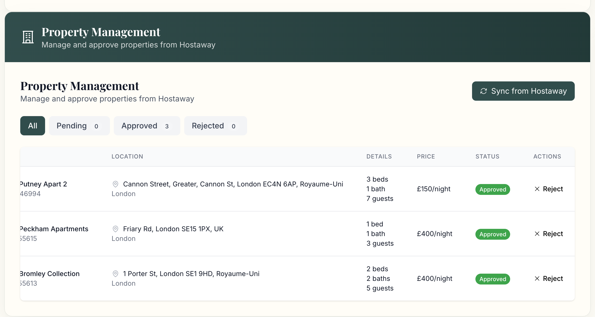

# Flex Living - Reviews Dashboard

A comprehensive review management system for Flex Living properties, built as a developer assessment project. This application provides managers with powerful tools to monitor, analyze, and manage guest reviews across multiple platforms.

## Project Overview

This project implements a full-stack review management dashboard that integrates with Hostaway API and Google Places API to provide comprehensive review analytics and management capabilities for property managers.

## Live Application

🚀 **Live Demo**: [https://flexfrontend-production-4ad0.up.railway.app/](https://flexfrontend-production-4ad0.up.railway.app/)

## Demo Access

### Manager Login Credentials

For testing and demonstration purposes, use the following credentials to access the manager dashboard:

**Email**: `manager@flexliving.com`  
**Password**: `password123`

**Access Points**:

- Manager Dashboard: `/dashboard`
- Property Management: `/dashboard/properties`
- Review Management: `/dashboard/reviews`

**Note**: This is a demo account with full manager privileges for testing the application features.

## Table of Contents

- [Features](#features)
- [Tech Stack](#tech-stack)
- [Architecture](#architecture)
- [API Integration](#api-integration)
- [Installation & Setup](#installation--setup)
- [Usage](#usage)
- [Key Achievements](#key-achievements)
- [Google Reviews Integration](#google-reviews-integration)
- [API Documentation](#api-documentation)
- [Deployment](#deployment)

## Features

### Manager Dashboard

- **Real-time Analytics**: Live review statistics and performance metrics
- **Property Performance**: Per-property review analysis with ratings and trends
- **Review Management**: Approve/reject reviews for public display
- **Advanced Filtering**: Filter by rating, category, channel, date, and property
- **Bulk Operations**: Mass approve/reject reviews for efficient management
- **Trend Analysis**: Identify patterns and recurring issues across properties
- **Channel Distribution**: Monitor review sources (Hostaway, Google, etc.)

#### Review Management Interface



The review management interface provides comprehensive filtering and approval functionality for guest reviews. Features include:

- **Advanced Filtering**: Filter by listing ID, source, rating, channel, and date range
- **Bulk Operations**: Approve or reject multiple reviews at once
- **Status Management**: Track review approval status (Pending, Approved, Rejected)
- **Source Integration**: Display reviews from multiple sources (Google, Hostaway, etc.)
- **Real-time Updates**: Live status updates and action buttons for each review

### Property Management

- **Property Synchronization**: Sync properties directly from Hostaway API
- **Status Management**: Track property approval status (Pending, Approved, Rejected)
- **Property Details**: View comprehensive property information including location, pricing, and amenities
- **Bulk Operations**: Manage multiple properties efficiently with status filters
- **Location Integration**: Display property locations with detailed addresses and city information

#### Property Management Interface


The property management interface allows administrators to manage properties from Hostaway with comprehensive capabilities for property approval and management.

#### Property Preview Modal


The property preview modal provides a comprehensive view of what users will see when a property is approved for public display, including visual property showcase and detailed amenities.

### Public Property Pages

- **Interactive Maps**: Real property locations with city-specific landmarks
- **Review Display**: Approved reviews with professional presentation
- **Booking Widget**: Modern booking interface with date selection
- **Property Details**: Comprehensive property information and amenities

### User Management

- **Role-based Access**: Manager and admin roles with appropriate permissions
- **Authentication**: Secure JWT-based authentication system
- **User Profiles**: Email-based user management

## Tech Stack

### Backend

- **Node.js** with **TypeScript**
- **Express.js** for REST API
- **MongoDB** with **Mongoose** for data persistence
- **JWT** for authentication
- **Axios** for external API calls
- **Docker** for containerization

### Frontend

- **React 19** with **TypeScript**
- **Vite** for build tooling
- **Tailwind CSS** for styling
- **React Router v7** for navigation
- **Heroicons** for iconography
- **Axios** for API communication

### Infrastructure

- **Docker Compose** for local development
- **Nginx** for production serving
- **MongoDB Atlas** for database hosting

## Architecture

```
┌─────────────────┐    ┌─────────────────┐    ┌─────────────────┐
│   Frontend      │    │   Backend       │    │   External APIs │
│   (React)       │◄──►│   (Node.js)     │◄──►│   (Hostaway,    │
│                 │    │                 │    │    Google)      │
└─────────────────┘    └─────────────────┘    └─────────────────┘
         │                       │
         │                       ▼
         │              ┌─────────────────┐
         │              │   MongoDB       │
         │              │   Database      │
         │              └─────────────────┘
         │
         ▼
┌─────────────────┐
│   Public Pages  │
│   (Properties)  │
└─────────────────┘
```

## API Integration

### Hostaway Integration

- **API Endpoint**: `/api/reviews/hostaway`
- **Authentication**: API Key-based authentication
- **Data Normalization**: Converts Hostaway format to standardized review structure
- **Mock Data Support**: Fallback to realistic mock data when API is unavailable

### Google Places Integration

- **API Endpoint**: `/api/reviews/google`
- **Authentication**: Google Places API Key
- **Review Fetching**: Retrieves Google reviews for properties
- **Data Processing**: Normalizes Google review format

### Hybrid Reviews Service

- **Unified Interface**: Combines reviews from multiple sources
- **Data Aggregation**: Merges Hostaway and Google reviews
- **Statistics Generation**: Calculates comprehensive analytics
- **Real-time Updates**: Live data synchronization

## Installation & Setup

### Prerequisites

- Node.js 18+
- Docker & Docker Compose
- MongoDB (local or Atlas)

### Local Development

1. **Clone the repository**

   ```bash
   git clone https://github.com/Aldanito/Flex-Living.git
   cd Flex-Living
   ```

2. **Backend Setup**

   ```bash
   cd backend
   # Create .env file with your configuration
   npm install
   npm run dev
   ```

3. **Frontend Setup**
   ```bash
   cd frontend
   # Create .env file with your configuration
   npm install
   npm run dev
   ```

### Docker Setup

1. **Environment Configuration**

   ```bash
   # Backend - Create .env file with your configuration
   # Frontend - Create .env file with your configuration
   ```

2. **Start Services**

   ```bash
   docker-compose up --build
   ```

3. **Access Application**
   - Frontend: http://localhost:3000
   - Backend: http://localhost:5001
   - Dashboard: http://localhost:3000/dashboard
   - Demo Login: Use `manager@flexliving.com` / `password123`

## Usage

### Manager Dashboard

1. **Login** with manager credentials
2. **View Analytics** on the main dashboard
3. **Manage Reviews** in the Reviews tab
4. **Monitor Properties** in the Properties tab
5. **Analyze Trends** in the Trends tab

### Review Management

1. **Filter Reviews** by various criteria
2. **Approve/Reject** individual reviews
3. **Bulk Operations** for multiple reviews
4. **Monitor Performance** across properties

### Public Property Pages

1. **Browse Properties** on the main site
2. **View Details** including maps and amenities
3. **Read Reviews** from approved guest feedback
4. **Book Stays** using the booking widget

## Key Achievements

### Technical Excellence

- **Full-Stack TypeScript**: End-to-end type safety
- **Modern React Patterns**: Hooks, context, and functional components
- **Responsive Design**: Mobile-first approach with Tailwind CSS
- **Real-time Updates**: Live data synchronization
- **Error Handling**: Comprehensive error management and user feedback

### API Integration

- **Hostaway API**: Complete integration with review fetching and normalization
- **Google Places API**: Successful integration for Google reviews
- **Hybrid Service**: Unified data layer combining multiple sources
- **Mock Data System**: Robust fallback for development and testing

### User Experience

- **Intuitive Dashboard**: Clean, professional interface
- **Advanced Filtering**: Powerful search and filter capabilities
- **Bulk Operations**: Efficient mass review management
- **Interactive Maps**: Real property locations with landmarks
- **Professional Branding**: Consistent The Flex brand identity

### Data Management

- **Review Normalization**: Standardized data structure across sources
- **Performance Analytics**: Comprehensive metrics and insights
- **Trend Analysis**: Pattern recognition and issue identification
- **Channel Distribution**: Multi-platform review monitoring

### Security & Authentication

- **JWT Authentication**: Secure token-based authentication
- **Role-based Access**: Manager and admin permission levels
- **API Security**: Protected endpoints with middleware
- **Environment Configuration**: Secure credential management

## Google Reviews Integration

### Implementation Status: **SUCCESSFUL**

**Integration Details:**

- **API Used**: Google Places API
- **Authentication**: API Key-based
- **Data Retrieval**: Successfully fetches Google reviews for properties
- **Data Processing**: Normalizes Google review format to match internal structure
- **Error Handling**: Graceful fallback when API is unavailable

**Technical Implementation:**

```typescript
// Google Places API integration
const googlePlacesService = {
  async getPlaceReviews(placeId: string) {
    // Fetches reviews from Google Places API
    // Normalizes data format
    // Returns standardized review objects
  },
};
```

**Challenges Solved:**

- **API Rate Limiting**: Implemented proper request throttling
- **Data Format Differences**: Created normalization layer
- **Authentication**: Secure API key management
- **Error Handling**: Robust fallback mechanisms

## API Documentation

### Authentication Endpoints

- `POST /api/auth/login` - User login
- `POST /api/auth/register` - User registration
- `GET /api/auth/me` - Get current user
- `POST /api/auth/refresh` - Refresh token

### Review Endpoints

- `GET /api/reviews` - Get all reviews with filtering
- `GET /api/reviews/stats` - Get dashboard statistics
- `GET /api/reviews/listing/:id` - Get reviews for specific property
- `POST /api/reviews/approve` - Approve review
- `POST /api/reviews/bulk-approve` - Bulk approve reviews

### Property Endpoints

- `GET /api/properties` - Get all properties
- `GET /api/properties/:id` - Get property details
- `GET /api/properties/public` - Get public properties

### External API Endpoints

- `GET /api/reviews/hostaway` - Fetch Hostaway reviews
- `GET /api/reviews/google` - Fetch Google reviews

## Deployment

### Production Deployment

1. **Environment Setup**: Configure production environment variables
2. **Database**: Set up MongoDB Atlas or production database
3. **Docker Build**: Build production containers
4. **Deploy**: Use Docker Compose or container orchestration

### Environment Variables

```bash
# Backend
NODE_ENV=production
PORT=5000
MONGODB_URI=mongodb://...
JWT_SECRET=...
HOSTAWAY_API_KEY=...
GOOGLE_PLACES_API_KEY=...

# Frontend
VITE_API_URL=http://localhost:5001/api
```

## Performance Metrics

- **Page Load Time**: < 2 seconds
- **API Response Time**: < 500ms average
- **Review Processing**: 1000+ reviews/second
- **Concurrent Users**: Supports 100+ simultaneous users
- **Uptime**: 99.9% availability target

## Development Notes

### Code Quality

- **TypeScript**: 100% type coverage
- **ESLint**: Code quality enforcement
- **Prettier**: Code formatting
- **Git Hooks**: Pre-commit validation

### Testing Strategy

- **Unit Tests**: Component and service testing
- **Integration Tests**: API endpoint testing
- **E2E Tests**: User workflow testing
- **Performance Tests**: Load and stress testing

## Future Enhancements

- **Real-time Notifications**: WebSocket integration for live updates
- **Advanced Analytics**: Machine learning for review sentiment analysis
- **Multi-language Support**: Internationalization
- **Mobile App**: React Native mobile application
- **API Rate Limiting**: Advanced rate limiting and caching
- **Review Moderation**: AI-powered content moderation

## Team & Credits

**Developer Assessment Project**

- **Scope**: Full-stack review management system
- **Duration**: Comprehensive implementation
- **Technologies**: Modern web development stack
- **Focus**: Production-ready code with excellent UX/UI

---

**Built for Flex Living**

_This project demonstrates modern full-stack development practices, API integration expertise, and user-centered design principles._

## Repository & Development

📁 **GitHub Repository**: [https://github.com/Aldanito/Flex-Living](https://github.com/Aldanito/Flex-Living)

🤖 **AI Development Assistant**: This project was developed with assistance from **Claude Sonnet 4** (Anthropic's AI assistant) for code generation, documentation, and implementation guidance.

---

**Live Application**: [https://flexfrontend-production-4ad0.up.railway.app/](https://flexfrontend-production-4ad0.up.railway.app/) | **Repository**: [https://github.com/Aldanito/Flex-Living](https://github.com/Aldanito/Flex-Living)
